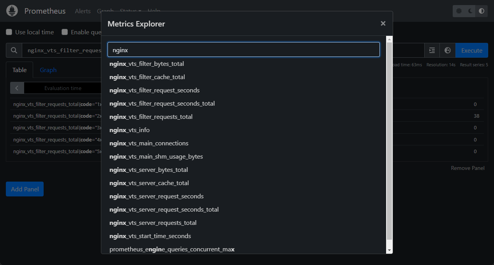
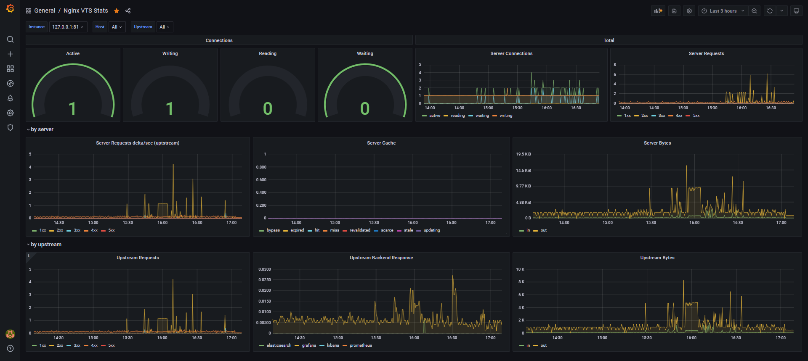

# nginx-vts prometheus

<p align="center">
	
	<br><br>
  
	
  
</p>

Simple nginx-vts image updater:
- Auto update current version nginx-alpine 
- VTS module build 
- Trivy scan image for vulnerabilities

**VTS**: Nginx virtual host traffic status module

Main links:
- docker-nginx - https://github.com/nginxinc/docker-nginx
- nginx-module-vts - https://github.com/vozlt/nginx-module-vts

### Commands 

#### pull
```shell
docker pull ghcr.io/akmalovaa/nginx-vts
```

#### or manual build
```shell
git clone https://github.com/akmalovaa/nginx-vts.git .
docker build . -t ghcr.io/akmalovaa/nginx-vts --build-arg VERSION=1.27.0
```

#### run
```shell
docker run -p 80:80 -p 9991:9991 ghcr.io/akmalovaa/nginx-vts
```


### Monitoring

### Prometheus format:

- **Prometheus:** http://localhost:9991/metrics
- **Web:** http://localhost:9991/vts

### Prometheus job config example

```YAML
  - job_name: nginx-vts
    scrape_interval: 15s
    scrape_timeout: 10s
    metrics_path: /metrics
    scheme: http
    static_configs:
      - targets: ['YOUR_IP:9991']
```

[](./.github/img/nginx_prometheus.png)


### Grafana dashboards example

https://grafana.com/grafana/dashboards/14824-nginx-vts-stats/

[](./.github/img/nginx_grafana.png)


### Web format example screenshot from the repo [vozlt/nginx-module-vts](https://github.com/vozlt/nginx-module-vts)

[](https://cloud.githubusercontent.com/assets/3648408/23890539/a4c0de18-08d5-11e7-9a8b-448662454854.png)