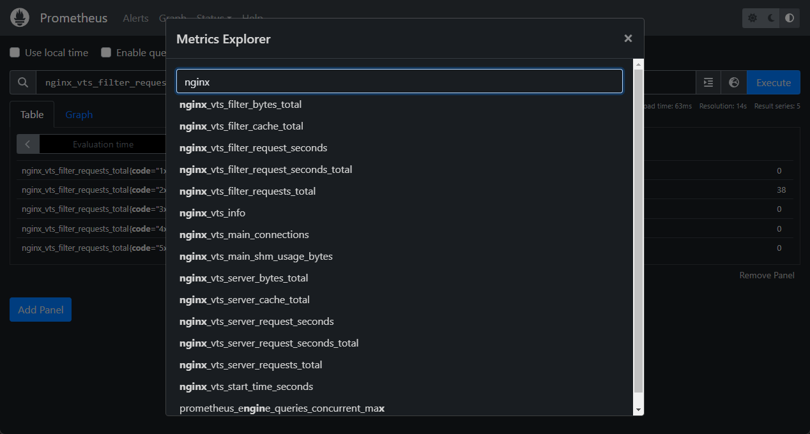
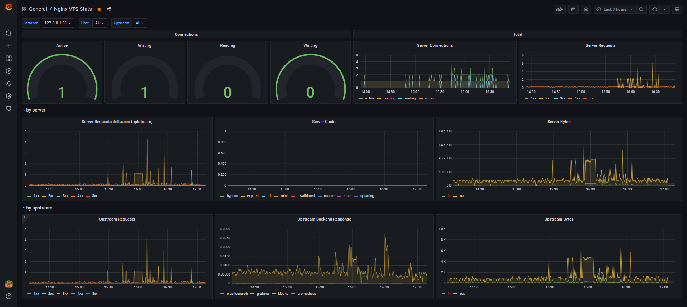

# nginx-vts

<p align="center">
  
  <br><br>
  
  
  
</p>

Nginx Alpine image with [nginx-module-vts](https://github.com/vozlt/nginx-module-vts) compiled as a dynamic module. Exposes Prometheus metrics and HTML dashboard out of the box.

## Features

- Multi-arch build: `linux/amd64`, `linux/arm64`
- Prometheus metrics at `/metrics` (port 9991)
- VTS HTML dashboard at `/vts` (port 9991)
- Metrics grouped by HTTP status code and URL pattern
- Metrics endpoint restricted to private networks
- Custom configs via `/etc/nginx/conf.d/*.conf`
- Image signed with [cosign](https://github.com/sigstore/cosign)

## Quick start

```shell
docker run -p 80:80 -p 9991:9991 ghcr.io/akmalovaa/nginx-vts
```

- http://localhost:9991/metrics — Prometheus format
- http://localhost:9991/vts — HTML dashboard

## Build

```shell
docker build . -t ghcr.io/akmalovaa/nginx-vts
```

Override versions via build args:

```shell
docker build . -t ghcr.io/akmalovaa/nginx-vts \
  --build-arg VERSION=1.29.8 \
  --build-arg VTS_VERSION=v0.2.5
```

## Custom nginx config

Mount your configs into the standard directory:

```shell
docker run -p 80:80 -p 9991:9991 \
  -v ./my-site.conf:/etc/nginx/conf.d/my-site.conf:ro \
  ghcr.io/akmalovaa/nginx-vts
```

Or replace `nginx.conf` entirely:

```shell
docker run -p 80:80 -p 9991:9991 \
  -v ./nginx.conf:/etc/nginx/nginx.conf:ro \
  ghcr.io/akmalovaa/nginx-vts
```

## Prometheus

Add a scrape job to your `prometheus.yml`:

```yaml
- job_name: nginx-vts
  scrape_interval: 15s
  metrics_path: /metrics
  static_configs:
    - targets: ['YOUR_IP:9991']
```

> **Note:** The metrics endpoint only accepts connections from private networks (`10.0.0.0/8`, `172.16.0.0/12`, `192.168.0.0/16`, `127.0.0.0/8`). Adjust `allow`/`deny` rules in `nginx.conf` if needed.

## Grafana

Recommended dashboards:

- [Nginx VTS Stats](https://grafana.com/grafana/dashboards/14824-nginx-vts-stats/)
- [Search all Nginx VTS dashboards](https://grafana.com/grafana/dashboards/?search=Nginx+VTS)

<details>
<summary>Screenshots</summary>

[](./.github/img/nginx_prometheus.png)

[](./.github/img/nginx_grafana.png)

</details>

> [!TIP]
> Consider [Angie](https://angie.software/angie/) — a modern fork of nginx with a built-in Prometheus metrics exporter, no third-party modules required.

## Links

- [nginxinc/docker-nginx](https://github.com/nginxinc/docker-nginx) — official nginx Docker image
- [vozlt/nginx-module-vts](https://github.com/vozlt/nginx-module-vts) — VTS module
